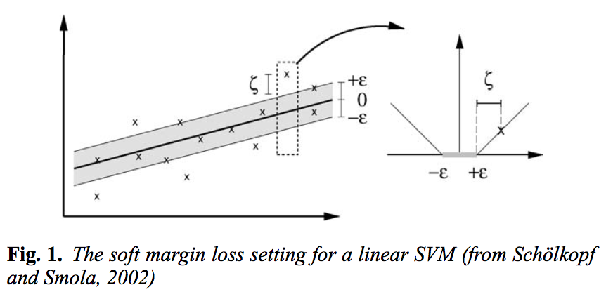

# Support Vector Regression

This method is regression equivalent of classification using [Support Vector Machines](../02-Classification/03-SupportVectorMachines.md).

### Basic Principle

Much like Support Vector Machines in general, the idea of SVR, is to find a plane(linear or otherwise) in a plane that allows us to make accurate predictions for future data. The regression is done in a way that all the currently available datapoints fit in an error width given by . This allows us to find a plane which fits the data best and then this can be used to make future predictions on more data. 

> Sometimes a soft error margin  may also be used to include additional points that lie outside the error margin .

### Nonlinearity

#### Nonlinearity by preprocessing

One way to application of SVR to represent nonlinear distributions is to map the training instances  using a map  into some feature space . 

> This is obviously a computationaly expensive method and would require an understanding of the data and its relationship with the dependent variable before any actions can be performed since the mapping function needs to be figures out. 

#### Implicit mapping via kernels

All the usual kernels that can be used with SVM classifiers, can be used in SVR as well. Code Reference [1] provides link to implementation and performance evaluations for various options available to be used as kernels. 

### Features

1. The implicit bias of the RBF based SVR model allows it to deal efficiently with outliers
2. The penalty parameter makes it the best choice for problems where data is high risk and noisy. 

## RESEARCH REFERENCES

1. **Support vector regression**; [Basak, Debasish, Srimanta Pal, and Dipak Chandra Patranabis](https://www.researchgate.net/profile/Mohamed_Mourad_Lafifi/post/Hi_could_anyone_tell_how_the_Epsilon-SVR_perform_the_regression_in_Support_Vector_Machines_SVM/attachment/59d6467c79197b80779a181a/AS:458289034076160@1486276028968/download/Review+Support+Vector+Regression.pdf); Neural Information Processing-Letters and Reviews 11.10 (2007): 203-224.

	**[SOLVED]** Review of various techniques, future scope in Support Vector Regression.
	
2. **A tutorial on support vector regression**; [Alex J. Smola and Bernhard Scḧolkopf](http://lasa.epfl.ch/teaching/lectures/ML_Phd/Notes/nu-SVM-SVR.pdf)

	**[SOLVED]** The basic principle of Support Vector Regression.
	
	
## CODE REFERENCES

1. **Numpy Based SVR**: [This article](http://scikit-learn.org/stable/auto_examples/svm/plot_svm_regression.html) provides various tutorials for implementation of SVR using various kernel options.

	> The penalty parameter **C** is used to regulate the problem of overfitting in SVR models. It can be tuned using Grid search or any better method for reducing the possibilitiy of overfitting. 
	
	> **Note** There is no implicit feature scaling in SVR Python, we need to do it explicity using 
	
	