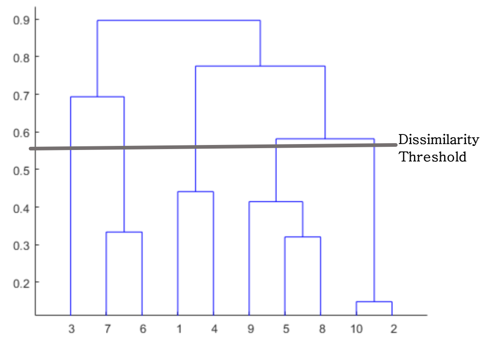

# Hierarchical Clustering

The idea behind this clustering algorithm is similar to K-means clustering but is different in quite a few aspects. It works as follows:
	
1. Assign each data point in the dataset a single cluster of its own
2. Take 2 closest data points in the dataset and join them to make 1 cluster (resulting in *n-1* clusters)
3. Take two closest clusters and make them 1 cluster (resulting in n-2 clusters)
4. Repeat **Step 3** until there is only one cluster
5. Finish

One might find the criterion for selection of closest clusters in **Step 3** to be ambiguous as a concept and unclear from the algorithm above. It is because, although it is based on Euclidean distances between clusters, there are multiple options within Euclidean distances when we are talking about more than two points, and we are discussing clusters here. There are four kinds of Euclidean distances that can be used for the selection of closest clusters and they are defined as follows:

1. Distance between closest points
2. Distance between farthest points
3. Mean of distances between all the points
4. Distance between centroids of the two clusters

### Dendrograms

A graph that allows us to remember what we did through the course of the entire algorithm. They typically represent the points and progression of clustering using HC algorithm. The height in a Dendrogram represents the distance between any two given points. In the above figure the points 10 and 2 are the closest to each other and form the first cluster reducing the size from 10 clusters in Step 1 to 9 clusters in Step 2. This keeps on progressing  as we go up the dendrogram, and merge clusters on the way

### Dissimilarity Threshold
The dissimilarity threshold is the horizontal bar that we set for obtaining clusters from a dendrogram. In the above example we set it to be 0.56 which means that any clusters with distance more than 0.56 should not be merged together to form any more clusters. This leaves us with 5 clusters containing points (3), (7, 6), (1, 4), (9, 5, 8) and (10, 2) respectively. 

Intuitively, the final number of clusters should always be equal to the number of lines passing by the Dissimilarity Threshold of the final dendrogram. 

Selecting the correct number of clusters is a decision that can be easily made on the basis of height of each of the vertical lines. The longest vertical lines usually go on to form the worst clusters. 

> It is important to note that the vertical lines that we consider for selecting the correct number of clusters, are not the original vertical lines but the lines that were formed after we extend all the horizontal lines as well. So the steps would be to extend all horizontal lines infinitely and then look for the longest vertical line possible. This distance would give us the optimal number of clusters. 

