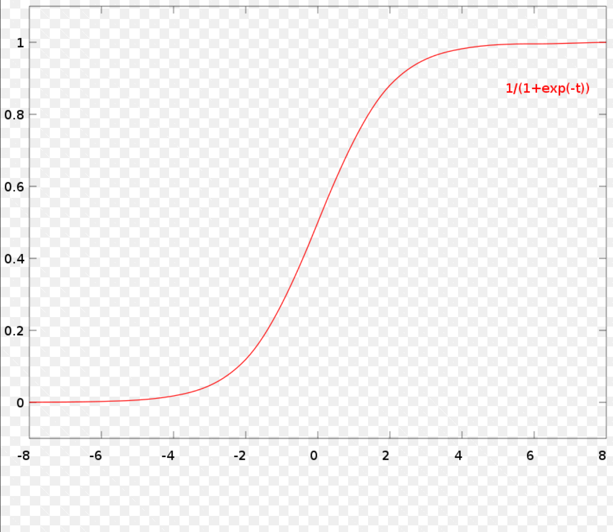
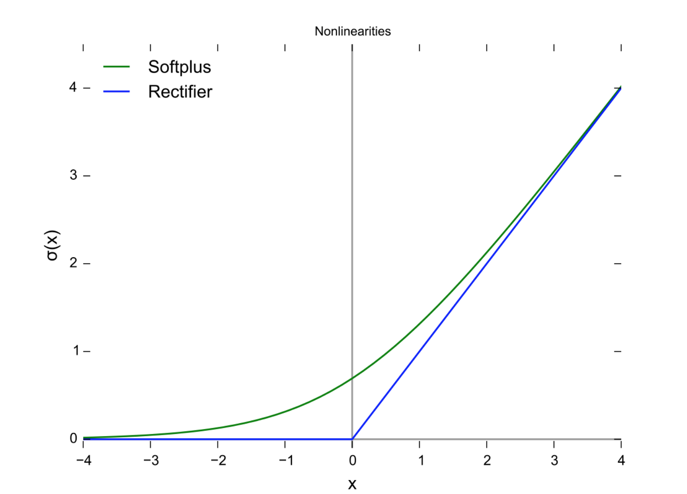
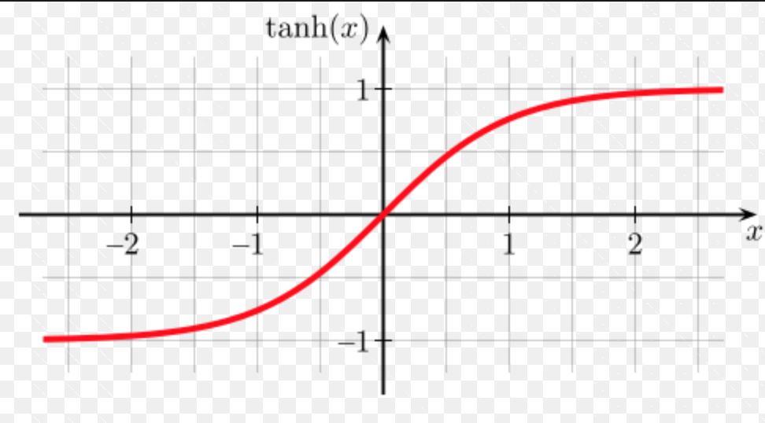
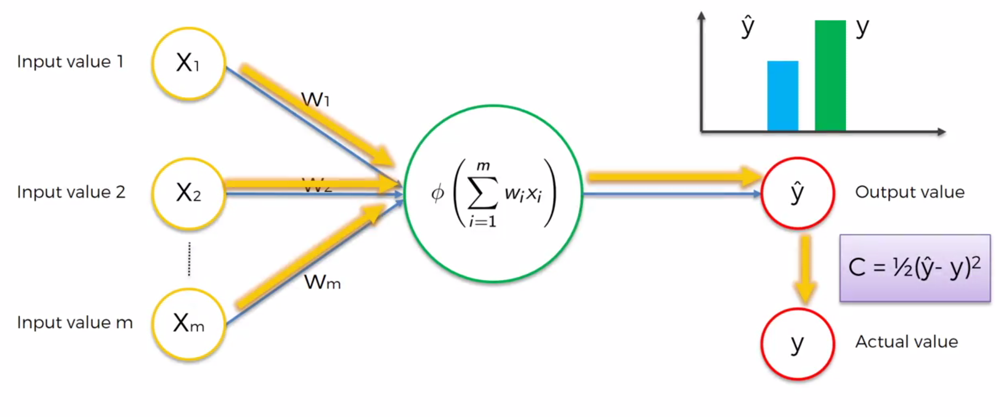

# Neural Networks

Neural Networks are the basis of most commonly used, and hyped machine learning algorithms. Deep Learning, NLP and many other branches have stemmed from them and there's a great deal of content to be learnt about them. 

## Key Terms

### Neurons

It is the basic building block of any neural network. The connection between two neurons is called a Synapse and it is where the signal is being passed. In a real world neuron (as shown in the figure below) the receptors are called **dendrites** and the transmitter is called the **axon**. Usually there is many dendrites and just one axon per neuron which makes sense, because a neuron should be able to receive a lot of information but the output from it should be clear and unambiguous. 

Every neuron is composed of two parts:

1. **Summation Function**: In a neural network, the summation operator sums all of a node's inputs to create a net input. It is mathematically represented as  
2. **Activation Function**: When a set of inputs is added into one (by the summation function) and the final input that is generated, it is processed using an **activation function** in order to be passed out as output from the neuron. This is the second component of any neuron in the hidden or output layer. The following list contains the names, and brief introductions of the predominant Activation Functions, used in the industry:

	(i) **Threshold Function**: The threshold function is the most basic activation function in practice. It basically says that if the value provided by summation function is less than a given threshold then return **0**, else return **1**. 

	(ii) **Sigmoid Function**: This function is a bit more interesting than the one above. It is given by the equation 
	
	
	
	and can be plotted as
	
	
	
	In the graph above, **x** is the sum of inputs. It is a smooth function and has a gradual progression hence making it useful in predicting probabilities. 
	
	(iii) **Rectifier Function**: Another very popular activation function used for neural networks is the rectifier function. It returns **0** up to a certain threshold and then starts returning the original value obtained from the input function. It is shown in the image below
	
	
	
	(iv) **Hyperbolic Tangent Function**: This function is similar to the Sigmoid function but the major difference is that it goes from **-1** to **1**. It is given by the equation 
	
	
	
	The graph of this function is:
	
	

> There are many other kinds of activation functions and probably, in due time, we might add a separate section dedicated to cover each one of those in detail and their possible applications, but these four are the most popular ones and necessary to start with. 

### Layers

There are three kinds of layers in any neural network:

1. **Input Layer**: This is the layer that is responsible for receiving the input observations one at a time. It is imperative (or normalize, subject to use case) that the input values are standardized before they are passed into the neural network. 
2. **Hidden Layer**: This layer is responsible for all the heavylifting and is the matrix that is configured through our various observations. 
3. **Output Layer**: This is the neuron layer that gives whatever output is required, as per our definition. If it is a regression problem then the output will have only one neuron, while in case of a classification problem, we will have as many neurons in the output layer, as are the number of classes. 

You can see the structure of all available types of neural networks, [here](./src/img/neuralnetworks.png).

Any hidden neuron, in the context of machine learning, takes its input from other neurons which are at the receiving end of data, i.e. sensors. The outputs from these **input layer neurons** serve as the input for the hidden layer neurons. 

### Synapses

Weights or Synapses are very important in neural networks as they are the controlling elements of the information that is being passed along. They basically control to what extent does a signal gets passed along?

## Working Procedure

The way that Neural Networks work can be seen in the image below

This allows us to have a detailed and complete understanding of the Neural Network's individual units. 

1. The yellow circles constitute the input layer, i.e. the layers that will be recieving the observations.
2. The yellow arrows show the trajectory of every observation in our dataset
3. **w1, w2 and w3** are the weights that we are trying to find. 
4. 

> The weights are the only things that we intend to find/learn in a neural network

## RESEARCH REFERENCES

1.  **Deep Sparse Rectifier neural networks**; [Xavier Glorot et al.](https://www.utc.fr/~bordesan/dokuwiki/_media/en/glorot10nipsworkshop.pdf)

	**[Solved]** The explanation for why the rectifier function is such an important asset for neural networks and often perform better over hyperbolic tangent activation functions.**(Activation Functions.Rectifier Function)**

