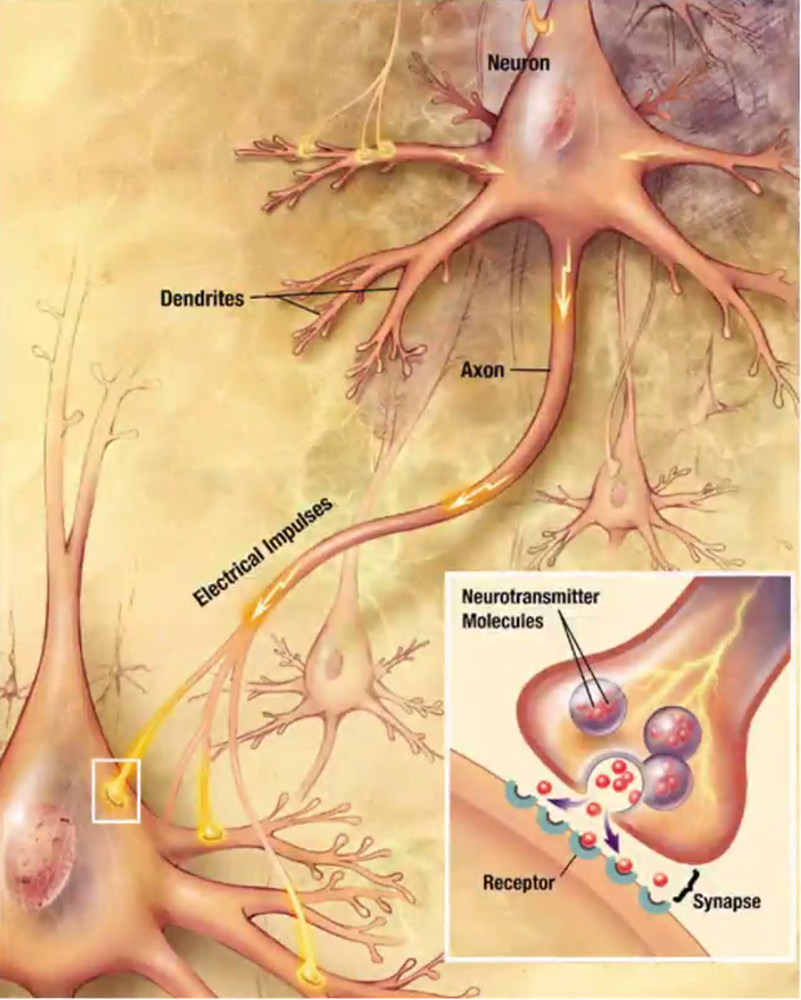

# Neural Networks

Neural Networks are the basis of most commonly used, and hyped machine learning algorithms. Deep Learning, NLP and many other branches have stemmed from them and there's a great deal of content to be learnt about them. 

## Key Terms

### Neurons

It is the basic building block of any neural network. The connection between two neurons is called a Synapse and it is where the signal is being passed. In a real world neuron (as shown in the figure below) the receptors are called **dendrites** and the transmitter is called the **axon**. Usually there is many dendrites and just one axon per neuron which makes sense, because a neuron should be able to receive a lot of information but the output from it should be clear and unambiguous. 

### Layers

There are three kinds of layers in any neural network:

1. **Input Layer**: This is the layer that is responsible for receiving the input observations one at a time. It is imperative (or normalize, subject to use case) that the input values are standardized before they are passed into the neural network. 
2. **Hidden Layer**: This layer is responsible for all the heavylifting and is the matrix that is configured through our various observations. 
3. **Output Layer**: This is the neuron layer that gives whatever output is required, as per out definition. 

You can see the structure of all available types of neural networks, [here](./src/img/neuralnetworks.png).

Any hidden neuron, in the context of machine learning, takes its input from other neurons which are at the receiving end of data, i.e. sensors. The outputs from these **input layer neurons** serve as the input for the hidden layer neurons. 